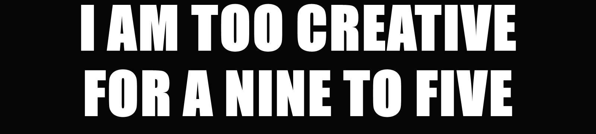

## about

Self-taught Solana dev from Belgium, shipping on-chain tools solo. I read the chain raw: mint and freeze authorities, holder maps, bundled wallets, first-block snipers. Nothing I build asks you to connect a wallet. Right now: **[Clearing](https://github.com/Akimbo365x/clearing)**, a rug check that shows who still controls a token before you ape in.

📡 [clearing111.netlify.app](https://clearing111.netlify.app) · 𝕏 [@Akimbo365](https://x.com/Akimbo365)

## core skills

- **languages:** javascript · python · html · css · powershell
- **web3:** Solana RPC · SPL tokens · on-chain holder analysis · wallet forensics · real-time alert bots
- **backend:** Netlify serverless functions · REST APIs · websockets
- **data:** DexScreener · Binance live feeds · JSON / CSV pipelines
- **tools:** Git · VS Code · Windows / PowerShell

